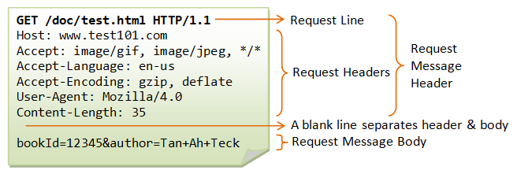

### URL

URI 包含 URL 和 URN，目前 WEB 只有 URL 比较流行，所以见到的基本都是 URL。

* URI（Uniform Resource Identifier，统一资源标识符）
* URL（Uniform Resource Locator，统一资源定位符）
* URN（Uniform Resource Name，统一资源名称）

### 请求和响应报文
1. 请求报文

    
2. 响应报文

    
    
    
### HTTP 方法
客户端发送的 请求报文 第一行为请求行，包含了方法字段。

#### GET
> 获取资源

当前网络请求中，绝大部分使用的是 GET 方法。

#### HEAD
> 获取报文首部

和 GET 方法一样，但是不返回报文实体主体部分。

主要用于确认 URL 的有效性以及资源更新的日期时间等。

#### POST
> 传输实体主体

POST 主要用来传输数据，而 GET 主要用来获取资源。

更多 POST 与 GET 的比较请见第九章。

#### PUT
> 上传文件

由于自身不带验证机制，任何人都可以上传文件，因此存在安全性问题，一般不使用该方法。
```html 
PUT /new.html HTTP/1.1
Host: example.com
Content-type: text/html
Content-length: 16

<p>New File</p>
```

#### PATCH
> 对资源进行部分修改

PUT 也可以用于修改资源，但是只能完全替代原始资源，PATCH 允许部分修改。

```html 
PATCH /file.txt HTTP/1.1
Host: www.example.com
Content-Type: application/example
If-Match: "e0023aa4e"
Content-Length: 100

[description of changes]
```

#### DELETE
> 删除文件

与 PUT 功能相反，并且同样不带验证机制。
```html
DELETE /file.html HTTP/1.1
```

#### OPTIONS
> 查询支持的方法

查询指定的 URL 能够支持的方法。

会返回 Allow: GET, POST, HEAD, OPTIONS 这样的内容。

#### CONNECT
> 要求在与代理服务器通信时建立隧道

使用 SSL（Secure Sockets Layer，安全套接层）和 TLS（Transport Layer Security，传输层安全）协议把通信内容加密后经网络隧道传输。

```html
CONNECT www.example.com:443 HTTP/1.1
```

#### TRACE
> 追踪路径

服务器会将通信路径返回给客户端。

发送请求时，在 Max-Forwards 首部字段中填入数值，每经过一个服务器就会减 1，当数值为 0 时就停止传输。

通常不会使用 TRACE，并且它容易受到 XST 攻击（Cross-Site Tracing，跨站追踪）。

### HTTP 状态码

服务器返回的  **响应报文**  中第一行为状态行，包含了状态码以及原因短语，用来告知客户端请求的结果。

| 状态码 | 类别 | 原因短语 |
| :---: | :---: | :---: |
| 1XX | Informational（信息性状态码） | 接收的请求正在处理 |
| 2XX | Success（成功状态码） | 请求正常处理完毕 |
| 3XX | Redirection（重定向状态码） | 需要进行附加操作以完成请求 |
| 4XX | Client Error（客户端错误状态码） | 服务器无法处理请求 |
| 5XX | Server Error（服务器错误状态码） | 服务器处理请求出错 |

#### 1XX 信息
* 100 Continue ：表明到目前为止都很正常，客户端可以继续发送请求或者忽略这个响应。

#### 2XX 成功
* 200 OK

* 204 No Content ：请求已经成功处理，但是返回的响应报文不包含实体的主体部分。一般在只需要从客户端往服务器发送信息，而不需要返回数据时使用。

* 206 Partial Content ：表示客户端进行了范围请求，响应报文包含由 Content-Range 指定范围的实体内容。

#### 3XX 重定向
* 301 Moved Permanently ：永久性重定向

* 302 Found ：临时性重定向

* 303 See Other ：和 302 有着相同的功能，但是 303 明确要求客户端应该采用 GET 方法获取资源。

    >注：虽然 HTTP 协议规定 301、302 状态下重定向时不允许把 POST 方法改成 GET 方法，但是大多数浏览器都会在 301、302 和 303 状态下的重定向把 POST 方法改成 GET 方法。

* 304 Not Modified ：如果请求报文首部包含一些条件，例如：If-Match，If-Modified-Since，If-None-Match，If-Range，If-Unmodified-Since，如果不满足条件，则服务器会返回 304 状态码。

* 307 Temporary Redirect ：临时重定向，与 302 的含义类似，但是 307 要求浏览器不会把重定向请求的 POST 方法改成 GET 方法。

#### 4XX 客户端错误
* 400 Bad Request ：请求报文中存在语法错误。

* 401 Unauthorized ：该状态码表示发送的请求需要有认证信息（BASIC 认证、DIGEST 认证）。如果之前已进行过一次请求，则表示用户认证失败。

* 403 Forbidden ：请求被拒绝。

* 404 Not Found

#### 5XX 服务器错误
* 500 Internal Server Error ：服务器正在执行请求时发生错误。

* 503 Service Unavailable ：服务器暂时处于超负载或正在进行停机维护，现在无法处理请求。


### 连接管理


#### HttpOnly
标记为 HttpOnly 的 Cookie 不能被 JavaScript 脚本调用。跨站脚本攻击 (XSS) 常常使用 JavaScript 的 Document.cookie API 窃取用户的 Cookie 信息，
因此使用 HttpOnly 标记可以在一定程度上避免 **XSS 攻击**。
```html
Set-Cookie: id=a3fWa; Expires=Wed, 21 Oct 2015 07:28:00 GMT; Secure; HttpOnly
```

#### Cookie 与 Session 选择
* Cookie 只能存储 ASCII 码字符串，而 Session 则可以存取任何类型的数据，因此在考虑数据复杂性时首选 Session；
* Cookie 存储在浏览器中，容易被恶意查看。如果非要将一些隐私数据存在 Cookie 中，可以将 Cookie 值进行加密，然后在服务器进行解密；
* 对于大型网站，如果用户所有的信息都存储在 Session 中，那么开销是非常大的，因此不建议将所有的用户信息都存储到 Session 中。


#### 内容协商

##### 1. 类型

1.1 服务端驱动型

客户端设置特定的 HTTP 首部字段，例如 Accept、Accept-Charset、Accept-Encoding、Accept-Language、Content-Languag，服务器根据这些字段返回特定的资源。

它存在以下问题：

- 服务器很难知道客户端浏览器的全部信息；
- 客户端提供的信息相当冗长（HTTP/2 协议的首部压缩机制缓解了这个问题），并且存在隐私风险（HTTP 指纹识别技术）；
- 给定的资源需要返回不同的展现形式，共享缓存的效率会降低，而服务器端的实现会越来越复杂。


1.2 代理驱动型

服务器返回 300 Multiple Choices 或者 406 Not Acceptable，客户端从中选出最合适的那个资源。

##### 2. Vary

```html
Vary: Accept-Language
```
在使用内容协商的情况下，只有当缓存服务器中的缓存满足内容协商条件时，才能使用该缓存，否则应该向源服务器请求该资源。

例如，一个客户端发送了一个包含 Accept-Language 首部字段的请求之后，源服务器返回的响应包含 `Vary: Accept-Language` 内容，缓存服务器对这个响应进行缓存之后，在客户端下一次访问同一个 URL 资源，并且 Accept-Language 与缓存中的对应的值相同时才会返回该缓存。

#### 内容编码
内容编码将**实体主体**(不会压缩请求和响应首部)进行压缩，从而减少传输的数据量。

常用的内容编码有：**gzip、compress、deflate、identity**。

浏览器发送 Accept-Encoding 首部，其中包含有它所支持的压缩算法，以及各自的优先级。服务器则从中选择一种，使用该算法对响应的消息主体进行压缩，并且发送 Content-Encoding 首部来告知浏览器它选择了哪一种算法。由于该内容协商过程是基于编码类型来选择资源的展现形式的，在响应的 Vary 首部至少要包含 Content-Encoding。

#### 多部分对象集合
一份报文主体内可含有多种类型的实体同时发送，每个部分之间用 boundary 字段定义的分隔符进行分隔，每个部分都可以有首部字段。

例如，上传多个表单时可以使用如下方式：

```html
Content-Type: multipart/form-data; boundary=AaB03x

--AaB03x
Content-Disposition: form-data; name="submit-name"

Larry
--AaB03x
Content-Disposition: form-data; name="files"; filename="file1.txt"
Content-Type: text/plain

... contents of file1.txt ...
--AaB03x--
```


### HTTPs

HTTPs 采用混合的加密机制，使用非对称密钥加密用于传输对称密钥来保证传输过程的安全性，之后使用对称密钥加密进行通信来保证通信过程的效率。（下图中的 Session Key 就是对称密钥）

<div align="center">  </div><br>

双向验证

<div align="center">  </div><br>


### HTTP/2.0

#### HTTP/1.x 缺陷
HTTP/1.x 实现简单是以牺牲性能为代价的：

* 客户端需要使用多个连接才能实现并发和缩短延迟；
* 不会压缩请求和响应首部，从而导致不必要的网络流量；
* 不支持有效的资源优先级，致使底层 TCP 连接的利用率低下。

#### 二进制分帧层
HTTP/2.0 将报文分成 HEADERS 帧和 DATA 帧，它们都是二进制格式的。

在通信过程中，只会有一个 TCP 连接存在，它承载了任意数量的双向数据流（Stream）。

* 一个数据流（Stream）都有一个唯一标识符和可选的优先级信息，用于承载双向信息。
* 消息（Message）是与逻辑请求或响应对应的完整的一系列帧。
* 帧（Frame）是最小的通信单位，来自不同数据流的帧可以交错发送，然后再根据每个帧头的数据流标识符重新组装。

<div align="center">  </div><br>


#### 服务端推送
HTTP/2.0 在客户端请求一个资源时，会把相关的资源一起发送给客户端，
客户端就不需要再次发起请求了。例如客户端请求 page.html 页面，
服务端就把 script.js 和 style.css 等与之相关的资源一起(通过其他数据流推送)发给客户端。


### HTTP/1.1 新特性

* 默认是长连接

* 支持管线化处理

* 支持同时打开多个 TCP 连接

* 支持虚拟主机(例如本地修改host ip 映射)

* 新增状态码 100(表明到目前为止都很正常，客户端可以继续发送请求或者忽略这个响应。)

* 支持分块传输编码(Chunked Transfer Coding，可以把数据分割成多块，让浏览器逐步显示页面)

* 新增缓存处理指令 max-age


### GET 和 POST 区别
#### 作用
GET 用于获取资源，而 POST 用于传输实体主体。

#### 参数
因为 URL 只支持 ASCII 码，因此 GET 的参数中如果存在中文等字符就需要先进行编码。例如 中文 会转换为 %E4%B8%AD%E6%96%87，而空格会转换为 %20。
POST 参考支持标准字符集。

#### 安全

安全的 HTTP 方法不会改变服务器状态，也就是说它只是可读的
> 安全的方法除了 GET 之外还有：HEAD、OPTIONS。
  不安全的方法除了 POST 之外还有 PUT、DELETE。

#### 幂等性
幂等的 HTTP 方法，同样的请求被执行一次与连续执行多次的效果是一样的，服务器的状态也是一样的。换句话说就是，幂等方法不应该具有副作用（统计用途除外）
> 在正确实现的条件下，GET，HEAD，PUT 和 DELETE 等方法都是幂等的，而 POST 方法不是。

#### 可缓存
一般GET 要进行缓存，POST不进行缓存

#### XMLHttpRequest
在使用 XMLHttpRequest 的 POST 方法时，浏览器会先发送 Header 再发送 Data。
> 但并不是所有浏览器会这么做，例如火狐就不会。

而 GET 方法 Header 和 Data 会一起发送。